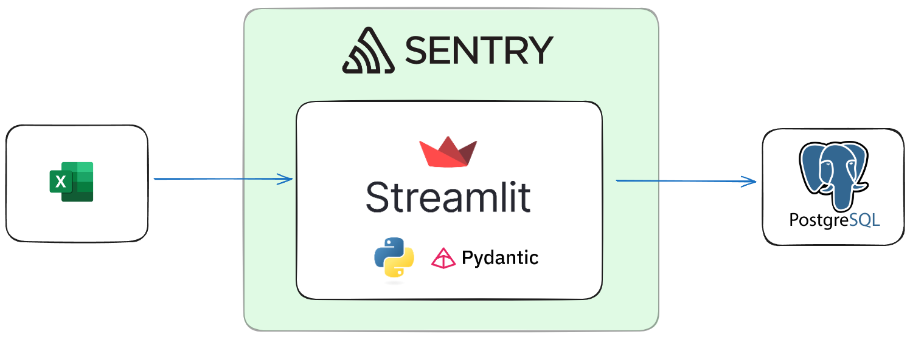
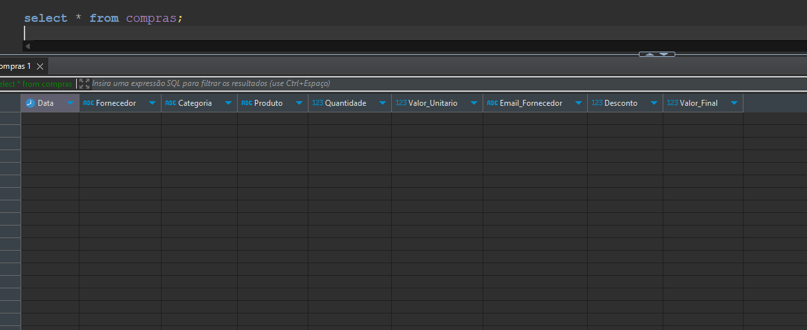
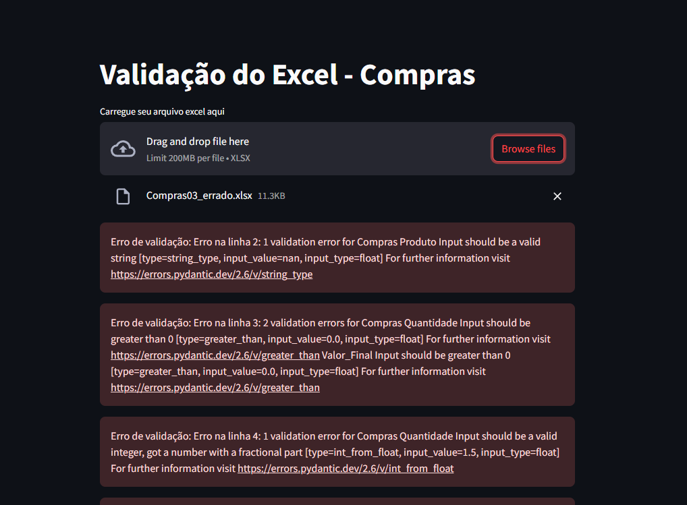
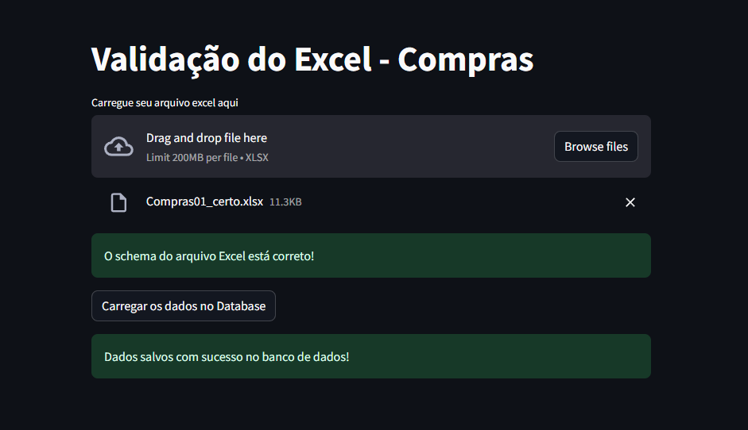
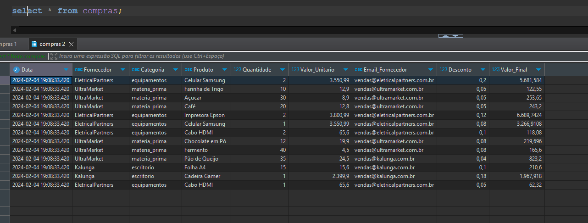
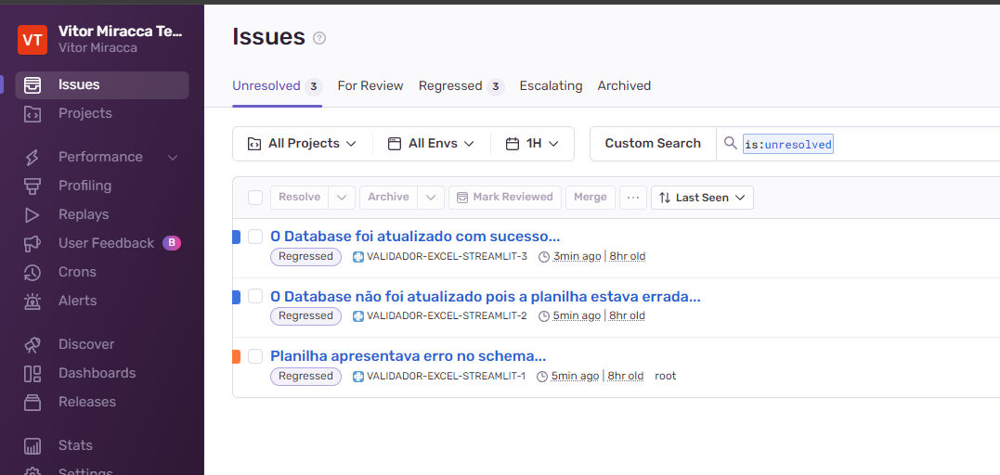

# Validador de Excel - Pydantic + Streamlit

Projeto com objetivo de aprendizado de novas tecnologias que podem ser úteis no meu dia a dia como Engenheiro de Dados: pydantic, para validação de integridade e qualdiade dos dados; pytest, para desenvolvimento de testes unitários e de integração, como também auxiliar para um CI/CD resiliente; streamlit, framework útil para interfaces simples, muito utilizada na área de dados; Sentry, para observabilidade da aplicação.

### Desafio / Objetivo:

Criar uma aplicação, com interface, para que usuários de uma empresa (neste case, um possível departamento de compras) possam inoutar seus controles de registros no banco de dados análitico da empresa, para que estes possam ser utilzidos em análises e relatórios posteriores.
A ideia é possui uma aplicação online, para que todos possam acessar a inputar seus arquivos excel. Entretanto, para garantir a integridade e qualidade dos dados, estes arquivos passaram por uma varredura, e só poderão sem inseridos no banco de dados se estiverem de acordo com o definido pelo negócio, caso contrário, a aplicação orientará o usuário a corrigir o seu controle.

### Arquitetura e Tecnologias:



Desenvolvemos um contrato, para servir para a validação do schema do excel, de acordo com os requisitos do negócio. 
Este contrato é realizado via pydantic e estabelesce as regras para o schema do excel ser habilitado para o INSERT no databse.    

Em seguida, desenvolvemos uma aplicação streamlit, onde o usuário consegue carregar o excel, para rodar a validação do mesmo (utilizando o contrato como base).
Se não validado, foi usado uma iteração dentre as linhas do arquivo, para que em cada linha onde a validação do contrato não passou, um erro seja lançado na tela e consegquentemente facilitar a leitura dos erros pelo usuário.
Se validado, a aplicação habilita o botão de carregar aos database, onde o backend irá inputar os registros do excel no database PostgreSQL que subimos.
    
Foi desenvolvido alguns testes utilizando o pytest para garantir a integridade da aplicação antes de submete-la ao repositório remoto, como testes unitários, testes funcionais e testes de integração.

Também iniciamos um Workflow para CI/CD (entrega contínua), com Github Actions. Esse workflow é startado a partir do Pull Request para a branch master e segue o fluxo de intalação do pyhton, instalação das dependência, execução dos testes. Assim, sendo a branch Master a branch de Produção, garantimos que nenhum Pull Request com códigos com Bugs (bugs cobertos pelos testes, diga-se de passagem) irão conseguir ser mergeados e impactar assim o ambeinte de Produção (usuários).

E por fim, utilizamos o serviço do Sentry para garantir que a aplicação esteja sendo monitorada sempre, a fim de receber alertas para os eventos que quiseremos, como por exemplo, ser avisado sempre que um arquivo é carregado para o database.

### A aplicação:

Este projeto, por mais que simples, está em Produção para teste completo, desde a interface do Streamlit, testes de upload de arquivos com schema errado para verificação dos erros, a inserção dos dados em banco de dados produtivo quando o schema for validado, como a observabildiade da aplicação.

Para acessar, basta entrar em:
https://validadorexcelstrealit.streamlit.app/

A seguir alguns prints da aplicação e as tecnologias utilizadas:

* Checar tabela no database antes do teste:


* Tentando upload com um arquivo errado:


* Upload de arquivo certo, como também envio ao database:


* Checar tabela no database após envio:


* Tela dos Issues no Sentry mostrando tudo que acontece durante este teste. Aqui poderiamos configurar envio de emails, categorizar melhor cada evento e etc...:


# Faça você mesmo

### Instalação e Configuração

1. Clone o repositório:
```bash
git clone https://github.com/vitormiracca/Validador_Excel_Strealit.git
cd Validador_Excel_Strealit
```
2. Configure a versão correta do Python (neste caso, gosto de usar o `pyenv`):
```bash
pyenv install 3.11.5
pyenv local 3.11.5
```
3. Crie seu ambiente e Instale as dependências do projeto:
```bash
python -m venv .venv
```
```bash
### Linux
source .venv/bin/activate
### Windows
.venv\Scripts\Activate
```
```bash
pip install -r requirements.txt  
```
4. Você deverá criar um banco de dados no PostgreSQL e em seguida, adicionar um arquivo (.env)com as seguintes variaveis:
```bash
touch .env
```
```conf
POSTGRES_USER=seu_user
POSTGRES_PASSWORD=sua_senha
POSTGRES_HOST=host
POSTGRES_PORT=5432
POSTGRES_DB=datbase
```
5. Crie uma tabela de compras (ou ajuste os códigos e defina um novo schema):
```sql
create table compras (
	id                       SERIAL primary key
    ,Data                    DATE not null
    ,Fornecedor              VARCHAR(100) not null
    ,Categoria               VARCHAR(100) not null
    ,Produto                 VARCHAR(150) not null
    ,Quantidade              INT not null
    ,Valor_Unitario          DECIMAL(20,2) not null
    ,Email_Fornecedor        VARCHAR(255),
    ,Desconto                DECIMAL(20,2),
    ,Valor_Final             DECIMAL(20,2) not null
);
```

6. Execução dos testes:
```bash
pytest test/
```

7. Entrar na aplicação:
```bash
streamlit run src/main.py
```
8. Caso esteja testando sem alterar o schema, use os arquivos .xlsx na pasta "data".
